# Diagrammes de séquence UML — MadaRisk Map

Ce document fournit le **code PlantUML** des diagrammes de séquence système de chaque
cas d'utilisation de la plateforme. Chaque bloc est autonome : il peut être collé tel
quel dans <https://www.plantuml.com/plantuml> ou compilé localement.

Généré à partir du code réel : `backend/src/routes/*`, `backend/src/services/*`,
`backend/src/repositories/*`, `backend/src/docs/openapi.yaml`.

---

## Conventions

### Acteurs

| Acteur | Description |
|---|---|
| `Visiteur` | Utilisateur non authentifié |
| `Analyste SIG` | Rôle `ANALYSTE_SIG` (imports, matching, consultation) |
| `Administrateur` | Rôles `ADMIN` / `SUPER_ADMIN` (pilotage de crise) |
| `Super Admin` | Rôle `SUPER_ADMIN` (utilisateurs, règles, suppressions) |
| `Client` | Rôle `CLIENT` (lecture seule) |
| `Planificateur` | `node-cron` in-process (jobs automatiques) |
| `Sources` | Open-Meteo, DGM Maproom, GDACS, IBTrACS/NCEI, Gemini |

### Participants techniques

| Participant | Rôle |
|---|---|
| `SPA` | Application React (Vite, TanStack Query, `src/api/client.ts`) |
| `API` | Serveur Express (`/api/v1`) |
| `Middlewares` | `rateLimit` → `validate(zod)` → `authenticate` → `authorize` |
| `Controller` | Couche HTTP (`src/controllers/*`) |
| `Service` | Logique métier (`src/services/*`) |
| `Repository` | Accès données (`src/repositories/*`) |
| `PostGIS` | PostgreSQL 16 + PostGIS |
| `SSE` | `realtimeService` (flux Server-Sent Events) |

### Réponses normalisées

- Succès : `{ success: true, message, data, meta? }`
- Erreur : `{ success: false, message, errors?: [{ field, message }] }`
- `422` = échec de validation, `401` = non authentifié, `403` = non autorisé,
  `429` = limitation de débit (`Retry-After`).

---

## A. Authentification et comptes

### UC-01 — S'authentifier

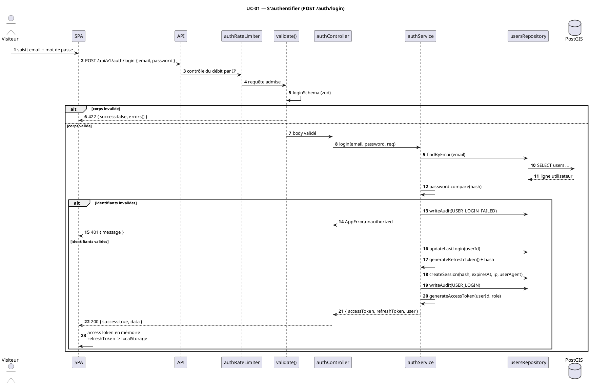
```plantuml
@startuml UC-01_authentification
title UC-01 — S'authentifier (POST /auth/login)
autonumber
actor "Visiteur" as U
participant "SPA" as SPA
participant "API" as API
participant "authRateLimiter" as RL
participant "validate()" as V
participant "authController" as C
participant "authService" as SVC
participant "usersRepository" as REPO
database "PostGIS" as DB

U -> SPA : saisit email + mot de passe
SPA -> API : POST /api/v1/auth/login { email, password }
API -> RL : contrôle du débit par IP
RL -> V : requête admise
V -> V : loginSchema (zod)
alt corps invalide
  V --> SPA : 422 { success:false, errors[] }
else corps valide
  V -> C : body validé
  C -> SVC : login(email, password, req)
  SVC -> REPO : findByEmail(email)
  REPO -> DB : SELECT users ...
  DB --> REPO : ligne utilisateur
  SVC -> SVC : password.compare(hash)
  alt identifiants invalides
    SVC -> REPO : writeAudit(USER_LOGIN_FAILED)
    SVC --> C : AppError.unauthorized
    C --> SPA : 401 { message }
  else identifiants valides
    SVC -> REPO : updateLastLogin(userId)
    SVC -> SVC : generateRefreshToken() + hash
    SVC -> REPO : createSession(hash, expiresAt, ip, userAgent)
    SVC -> REPO : writeAudit(USER_LOGIN)
    SVC -> SVC : generateAccessToken(userId, role)
    SVC --> C : { accessToken, refreshToken, user }
    C --> SPA : 200 { success:true, data }
    SPA -> SPA : accessToken en mémoire\nrefreshToken -> localStorage
  end
end
@enduml
```

### UC-02 — Renouveler la session (rotation du refresh token)

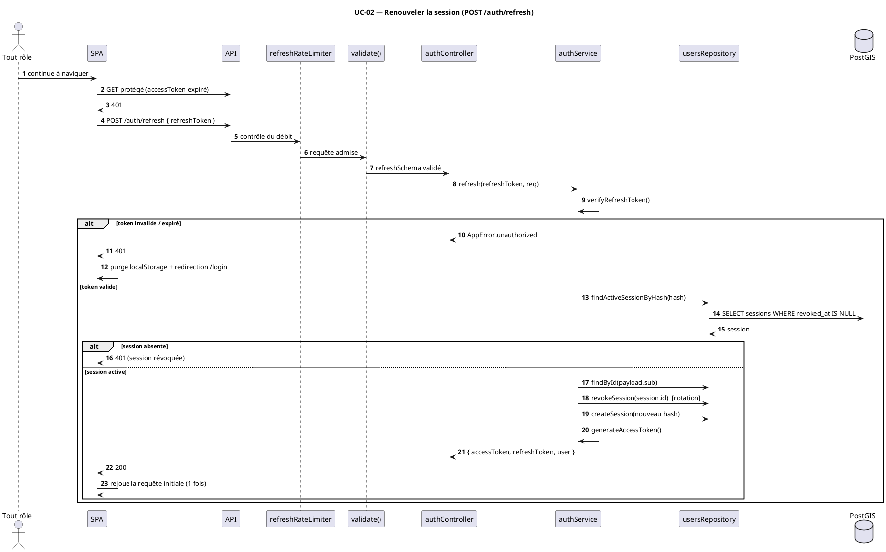
```plantuml
@startuml UC-02_refresh
title UC-02 — Renouveler la session (POST /auth/refresh)
autonumber
actor "Tout rôle" as U
participant "SPA" as SPA
participant "API" as API
participant "refreshRateLimiter" as RL
participant "validate()" as V
participant "authController" as C
participant "authService" as SVC
participant "usersRepository" as REPO
database "PostGIS" as DB

U -> SPA : continue à naviguer
SPA -> API : GET protégé (accessToken expiré)
API --> SPA : 401
SPA -> API : POST /auth/refresh { refreshToken }
API -> RL : contrôle du débit
RL -> V : requête admise
V -> C : refreshSchema validé
C -> SVC : refresh(refreshToken, req)
SVC -> SVC : verifyRefreshToken()
alt token invalide / expiré
  SVC --> C : AppError.unauthorized
  C --> SPA : 401
  SPA -> SPA : purge localStorage + redirection /login
else token valide
  SVC -> REPO : findActiveSessionByHash(hash)
  REPO -> DB : SELECT sessions WHERE revoked_at IS NULL
  DB --> REPO : session
  alt session absente
    SVC --> SPA : 401 (session révoquée)
  else session active
    SVC -> REPO : findById(payload.sub)
    SVC -> REPO : revokeSession(session.id)  [rotation]
    SVC -> REPO : createSession(nouveau hash)
    SVC -> SVC : generateAccessToken()
    SVC --> C : { accessToken, refreshToken, user }
    C --> SPA : 200
    SPA -> SPA : rejoue la requête initiale (1 fois)
  end
end
@enduml
```

### UC-03 — Se déconnecter

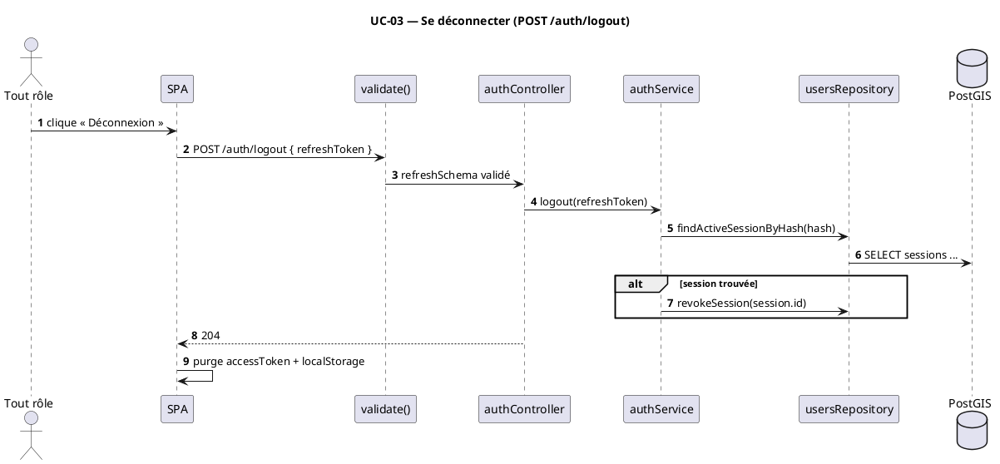
```plantuml
@startuml UC-03_logout
title UC-03 — Se déconnecter (POST /auth/logout)
autonumber
actor "Tout rôle" as U
participant "SPA" as SPA
participant "validate()" as V
participant "authController" as C
participant "authService" as SVC
participant "usersRepository" as REPO
database "PostGIS" as DB

U -> SPA : clique « Déconnexion »
SPA -> V : POST /auth/logout { refreshToken }
V -> C : refreshSchema validé
C -> SVC : logout(refreshToken)
SVC -> REPO : findActiveSessionByHash(hash)
REPO -> DB : SELECT sessions ...
alt session trouvée
  SVC -> REPO : revokeSession(session.id)
end
C --> SPA : 204
SPA -> SPA : purge accessToken + localStorage
@enduml
```

### UC-04 — Consulter son profil

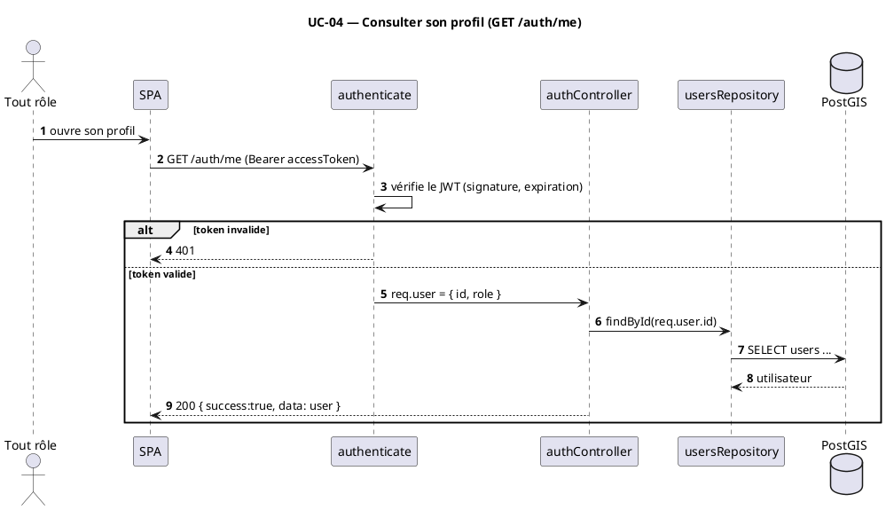
```plantuml
@startuml UC-04_profil
title UC-04 — Consulter son profil (GET /auth/me)
autonumber
actor "Tout rôle" as U
participant "SPA" as SPA
participant "authenticate" as AUTH
participant "authController" as C
participant "usersRepository" as REPO
database "PostGIS" as DB

U -> SPA : ouvre son profil
SPA -> AUTH : GET /auth/me (Bearer accessToken)
AUTH -> AUTH : vérifie le JWT (signature, expiration)
alt token invalide
  AUTH --> SPA : 401
else token valide
  AUTH -> C : req.user = { id, role }
  C -> REPO : findById(req.user.id)
  REPO -> DB : SELECT users ...
  DB --> REPO : utilisateur
  C --> SPA : 200 { success:true, data: user }
end
@enduml
```

### UC-05 — Gérer les utilisateurs (Super Admin)

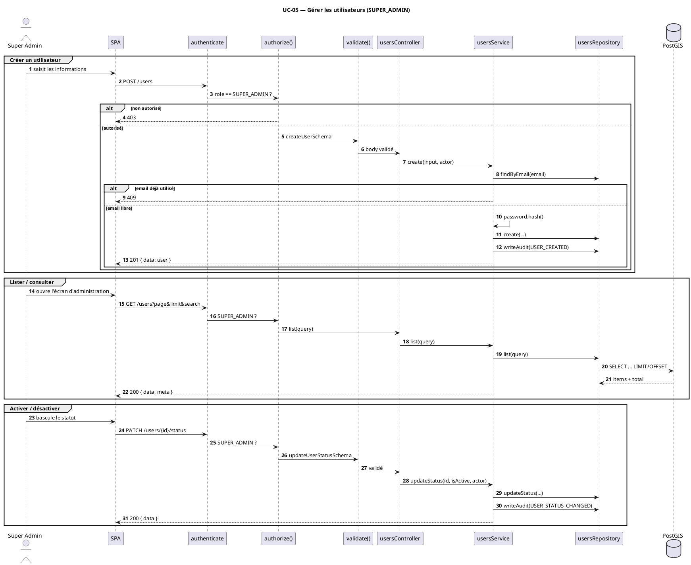
```plantuml
@startuml UC-05_utilisateurs
title UC-05 — Gérer les utilisateurs (SUPER_ADMIN)
autonumber
actor "Super Admin" as U
participant "SPA" as SPA
participant "authenticate" as AUTH
participant "authorize()" as AZ
participant "validate()" as V
participant "usersController" as C
participant "usersService" as SVC
participant "usersRepository" as REPO
database "PostGIS" as DB

group Créer un utilisateur
  U -> SPA : saisit les informations
  SPA -> AUTH : POST /users
  AUTH -> AZ : role == SUPER_ADMIN ?
  alt non autorisé
    AZ --> SPA : 403
  else autorisé
    AZ -> V : createUserSchema
    V -> C : body validé
    C -> SVC : create(input, actor)
    SVC -> REPO : findByEmail(email)
    alt email déjà utilisé
      SVC --> SPA : 409
    else email libre
      SVC -> SVC : password.hash()
      SVC -> REPO : create(...)
      SVC -> REPO : writeAudit(USER_CREATED)
      SVC --> SPA : 201 { data: user }
    end
  end
end

group Lister / consulter
  U -> SPA : ouvre l'écran d'administration
  SPA -> AUTH : GET /users?page&limit&search
  AUTH -> AZ : SUPER_ADMIN ?
  AZ -> C : list(query)
  C -> SVC : list(query)
  SVC -> REPO : list(query)
  REPO -> DB : SELECT ... LIMIT/OFFSET
  DB --> REPO : items + total
  SVC --> SPA : 200 { data, meta }
end

group Activer / désactiver
  U -> SPA : bascule le statut
  SPA -> AUTH : PATCH /users/{id}/status
  AUTH -> AZ : SUPER_ADMIN ?
  AZ -> V : updateUserStatusSchema
  V -> C : validé
  C -> SVC : updateStatus(id, isActive, actor)
  SVC -> REPO : updateStatus(...)
  SVC -> REPO : writeAudit(USER_STATUS_CHANGED)
  SVC --> SPA : 200 { data }
end
@enduml
```

### UC-06 — Changer son mot de passe

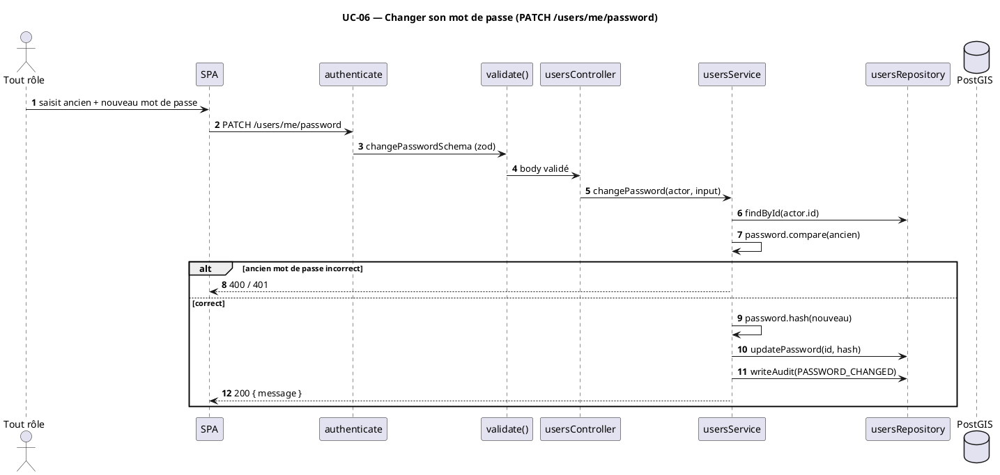
```plantuml
@startuml UC-06_motdepasse
title UC-06 — Changer son mot de passe (PATCH /users/me/password)
autonumber
actor "Tout rôle" as U
participant "SPA" as SPA
participant "authenticate" as AUTH
participant "validate()" as V
participant "usersController" as C
participant "usersService" as SVC
participant "usersRepository" as REPO
database "PostGIS" as DB

U -> SPA : saisit ancien + nouveau mot de passe
SPA -> AUTH : PATCH /users/me/password
AUTH -> V : changePasswordSchema (zod)
V -> C : body validé
C -> SVC : changePassword(actor, input)
SVC -> REPO : findById(actor.id)
SVC -> SVC : password.compare(ancien)
alt ancien mot de passe incorrect
  SVC --> SPA : 400 / 401
else correct
  SVC -> SVC : password.hash(nouveau)
  SVC -> REPO : updatePassword(id, hash)
  SVC -> REPO : writeAudit(PASSWORD_CHANGED)
  SVC --> SPA : 200 { message }
end
@enduml
```

---

## B. Référentiel territorial

### UC-07 — Consulter le référentiel et les couches cartographiques

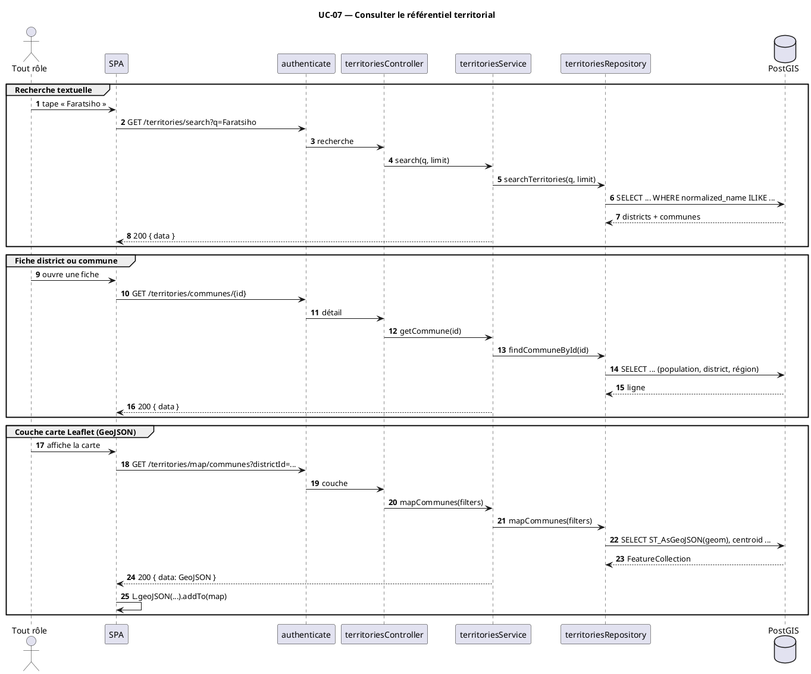
```plantuml
@startuml UC-07_territoires
title UC-07 — Consulter le référentiel territorial
autonumber
actor "Tout rôle" as U
participant "SPA" as SPA
participant "authenticate" as AUTH
participant "territoriesController" as C
participant "territoriesService" as SVC
participant "territoriesRepository" as REPO
database "PostGIS" as DB

group Recherche textuelle
  U -> SPA : tape « Faratsiho »
  SPA -> AUTH : GET /territories/search?q=Faratsiho
  AUTH -> C : recherche
  C -> SVC : search(q, limit)
  SVC -> REPO : searchTerritories(q, limit)
  REPO -> DB : SELECT ... WHERE normalized_name ILIKE ...
  DB --> REPO : districts + communes
  SVC --> SPA : 200 { data }
end

group Fiche district ou commune
  U -> SPA : ouvre une fiche
  SPA -> AUTH : GET /territories/communes/{id}
  AUTH -> C : détail
  C -> SVC : getCommune(id)
  SVC -> REPO : findCommuneById(id)
  REPO -> DB : SELECT ... (population, district, région)
  DB --> REPO : ligne
  SVC --> SPA : 200 { data }
end

group Couche carte Leaflet (GeoJSON)
  U -> SPA : affiche la carte
  SPA -> AUTH : GET /territories/map/communes?districtId=...
  AUTH -> C : couche
  C -> SVC : mapCommunes(filters)
  SVC -> REPO : mapCommunes(filters)
  REPO -> DB : SELECT ST_AsGeoJSON(geom), centroid ...
  DB --> REPO : FeatureCollection
  SVC --> SPA : 200 { data: GeoJSON }
  SPA -> SPA : L.geoJSON(...).addTo(map)
end
@enduml
```

---

## C. Imports et rapprochement (matching)

### UC-08 — Importer un fichier SIG

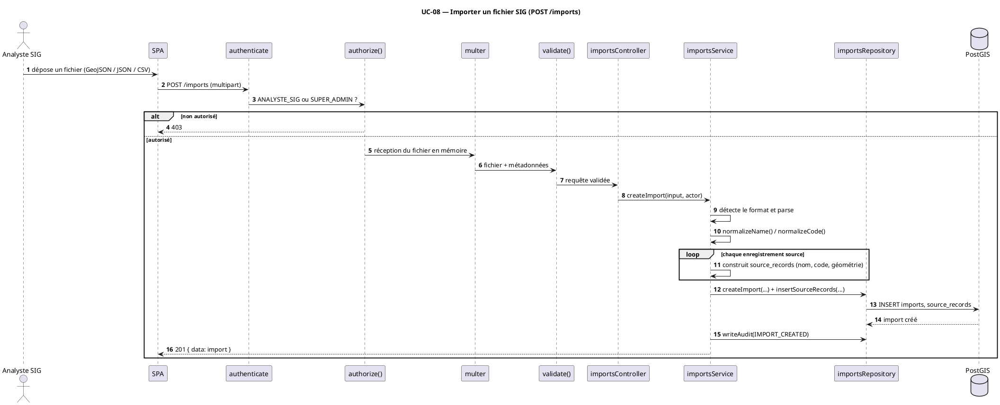
```plantuml
@startuml UC-08_import
title UC-08 — Importer un fichier SIG (POST /imports)
autonumber
actor "Analyste SIG" as U
participant "SPA" as SPA
participant "authenticate" as AUTH
participant "authorize()" as AZ
participant "multer" as MU
participant "validate()" as V
participant "importsController" as C
participant "importsService" as SVC
participant "importsRepository" as REPO
database "PostGIS" as DB

U -> SPA : dépose un fichier (GeoJSON / JSON / CSV)
SPA -> AUTH : POST /imports (multipart)
AUTH -> AZ : ANALYSTE_SIG ou SUPER_ADMIN ?
alt non autorisé
  AZ --> SPA : 403
else autorisé
  AZ -> MU : réception du fichier en mémoire
  MU -> V : fichier + métadonnées
  V -> C : requête validée
  C -> SVC : createImport(input, actor)
  SVC -> SVC : détecte le format et parse
  SVC -> SVC : normalizeName() / normalizeCode()
  loop chaque enregistrement source
    SVC -> SVC : construit source_records (nom, code, géométrie)
  end
  SVC -> REPO : createImport(...) + insertSourceRecords(...)
  REPO -> DB : INSERT imports, source_records
  DB --> REPO : import créé
  SVC -> REPO : writeAudit(IMPORT_CREATED)
  SVC --> SPA : 201 { data: import }
end
@enduml
```

### UC-09 — Lancer et valider le rapprochement

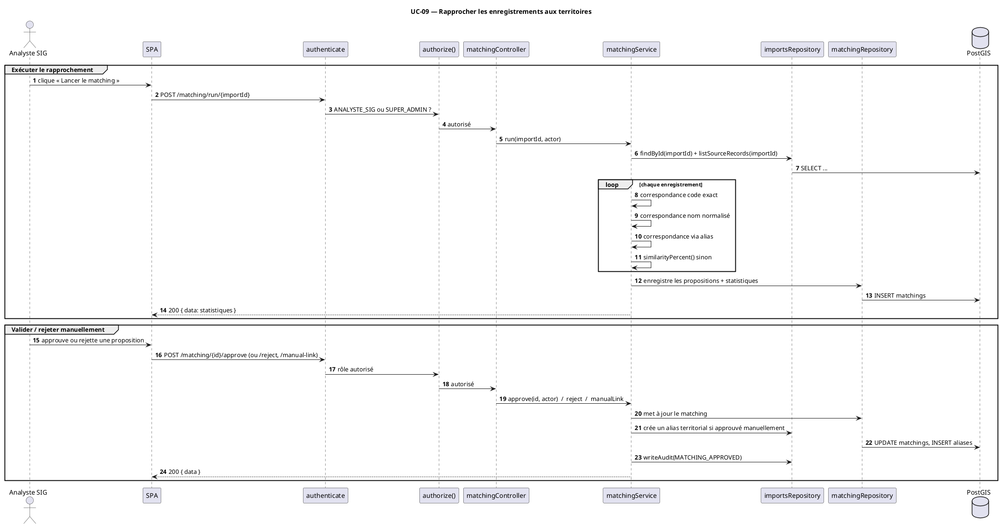
```plantuml
@startuml UC-09_matching
title UC-09 — Rapprocher les enregistrements aux territoires
autonumber
actor "Analyste SIG" as U
participant "SPA" as SPA
participant "authenticate" as AUTH
participant "authorize()" as AZ
participant "matchingController" as C
participant "matchingService" as SVC
participant "importsRepository" as IMP
participant "matchingRepository" as MREPO
database "PostGIS" as DB

group Exécuter le rapprochement
  U -> SPA : clique « Lancer le matching »
  SPA -> AUTH : POST /matching/run/{importId}
  AUTH -> AZ : ANALYSTE_SIG ou SUPER_ADMIN ?
  AZ -> C : autorisé
  C -> SVC : run(importId, actor)
  SVC -> IMP : findById(importId) + listSourceRecords(importId)
  IMP -> DB : SELECT ...
  loop chaque enregistrement
    SVC -> SVC : correspondance code exact
    SVC -> SVC : correspondance nom normalisé
    SVC -> SVC : correspondance via alias
    SVC -> SVC : similarityPercent() sinon
  end
  SVC -> MREPO : enregistre les propositions + statistiques
  MREPO -> DB : INSERT matchings
  SVC --> SPA : 200 { data: statistiques }
end

group Valider / rejeter manuellement
  U -> SPA : approuve ou rejette une proposition
  SPA -> AUTH : POST /matching/{id}/approve (ou /reject, /manual-link)
  AUTH -> AZ : rôle autorisé
  AZ -> C : autorisé
  C -> SVC : approve(id, actor)  /  reject  /  manualLink
  SVC -> MREPO : met à jour le matching
  SVC -> IMP : crée un alias territorial si approuvé manuellement
  MREPO -> DB : UPDATE matchings, INSERT aliases
  SVC -> IMP : writeAudit(MATCHING_APPROVED)
  SVC --> SPA : 200 { data }
end
@enduml
```

---

## D. Événements, trajectoires et exposition

### UC-10 — Créer et faire vivre un événement

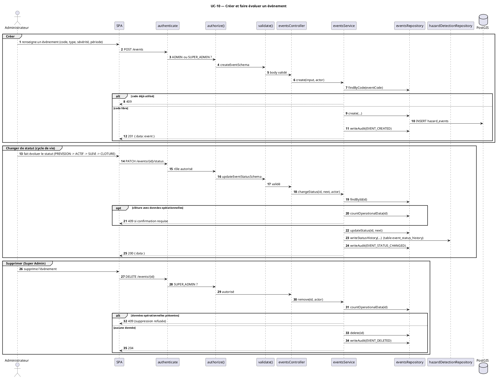
```plantuml
@startuml UC-10_evenement
title UC-10 — Créer et faire évoluer un événement
autonumber
actor "Administrateur" as U
participant "SPA" as SPA
participant "authenticate" as AUTH
participant "authorize()" as AZ
participant "validate()" as V
participant "eventsController" as C
participant "eventsService" as SVC
participant "eventsRepository" as REPO
participant "hazardDetectionRepository" as HREPO
database "PostGIS" as DB

group Créer
  U -> SPA : renseigne un événement (code, type, sévérité, période)
  SPA -> AUTH : POST /events
  AUTH -> AZ : ADMIN ou SUPER_ADMIN ?
  AZ -> V : createEventSchema
  V -> C : body validé
  C -> SVC : create(input, actor)
  SVC -> REPO : findByCode(eventCode)
  alt code déjà utilisé
    SVC --> SPA : 409
  else code libre
    SVC -> REPO : create(...)
    REPO -> DB : INSERT hazard_events
    SVC -> REPO : writeAudit(EVENT_CREATED)
    SVC --> SPA : 201 { data: event }
  end
end

group Changer de statut (cycle de vie)
  U -> SPA : fait évoluer le statut (PREVISION -> ACTIF -> SUIVI -> CLOTURE)
  SPA -> AUTH : PATCH /events/{id}/status
  AUTH -> AZ : rôle autorisé
  AZ -> V : updateEventStatusSchema
  V -> C : validé
  C -> SVC : changeStatus(id, next, actor)
  SVC -> REPO : findById(id)
  opt clôture avec données opérationnelles
    SVC -> REPO : countOperationalData(id)
    SVC --> SPA : 409 si confirmation requise
  end
  SVC -> REPO : updateStatus(id, next)
  SVC -> HREPO : writeStatusHistory(...)  (table event_status_history)
  SVC -> REPO : writeAudit(EVENT_STATUS_CHANGED)
  SVC --> SPA : 200 { data }
end

group Supprimer (Super Admin)
  U -> SPA : supprime l'événement
  SPA -> AUTH : DELETE /events/{id}
  AUTH -> AZ : SUPER_ADMIN ?
  AZ -> C : autorisé
  C -> SVC : remove(id, actor)
  SVC -> REPO : countOperationalData(id)
  alt données opérationnelles présentes
    SVC --> SPA : 409 (suppression refusée)
  else aucune donnée
    SVC -> REPO : delete(id)
    SVC -> REPO : writeAudit(EVENT_DELETED)
    SVC --> SPA : 204
  end
end
@enduml
```

### UC-11 — Ajouter une trajectoire et consulter la position à un instant

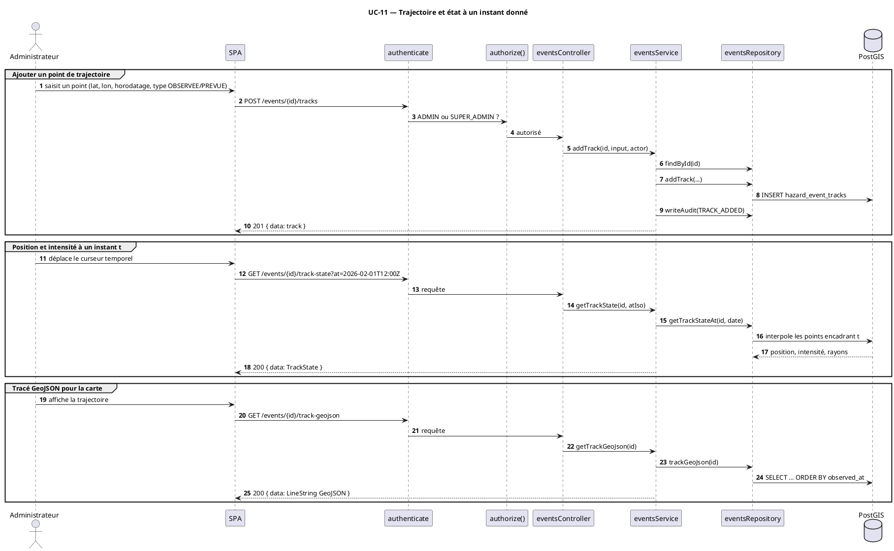
```plantuml
@startuml UC-11_trajectoire
title UC-11 — Trajectoire et état à un instant donné
autonumber
actor "Administrateur" as U
participant "SPA" as SPA
participant "authenticate" as AUTH
participant "authorize()" as AZ
participant "eventsController" as C
participant "eventsService" as SVC
participant "eventsRepository" as REPO
database "PostGIS" as DB

group Ajouter un point de trajectoire
  U -> SPA : saisit un point (lat, lon, horodatage, type OBSERVEE/PREVUE)
  SPA -> AUTH : POST /events/{id}/tracks
  AUTH -> AZ : ADMIN ou SUPER_ADMIN ?
  AZ -> C : autorisé
  C -> SVC : addTrack(id, input, actor)
  SVC -> REPO : findById(id)
  SVC -> REPO : addTrack(...)
  REPO -> DB : INSERT hazard_event_tracks
  SVC -> REPO : writeAudit(TRACK_ADDED)
  SVC --> SPA : 201 { data: track }
end

group Position et intensité à un instant t
  U -> SPA : déplace le curseur temporel
  SPA -> AUTH : GET /events/{id}/track-state?at=2026-02-01T12:00Z
  AUTH -> C : requête
  C -> SVC : getTrackState(id, atIso)
  SVC -> REPO : getTrackStateAt(id, date)
  REPO -> DB : interpole les points encadrant t
  DB --> REPO : position, intensité, rayons
  SVC --> SPA : 200 { data: TrackState }
end

group Tracé GeoJSON pour la carte
  U -> SPA : affiche la trajectoire
  SPA -> AUTH : GET /events/{id}/track-geojson
  AUTH -> C : requête
  C -> SVC : getTrackGeoJson(id)
  SVC -> REPO : trackGeoJson(id)
  REPO -> DB : SELECT ... ORDER BY observed_at
  SVC --> SPA : 200 { data: LineString GeoJSON }
end
@enduml
```

### UC-12 — Calculer une zone d'influence

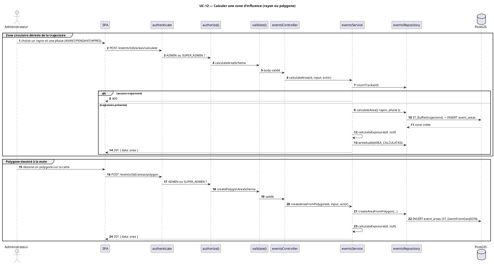
```plantuml
@startuml UC-12_zone
title UC-12 — Calculer une zone d'influence (rayon ou polygone)
autonumber
actor "Administrateur" as U
participant "SPA" as SPA
participant "authenticate" as AUTH
participant "authorize()" as AZ
participant "validate()" as V
participant "eventsController" as C
participant "eventsService" as SVC
participant "eventsRepository" as REPO
database "PostGIS" as DB

group Zone circulaire dérivée de la trajectoire
  U -> SPA : choisit un rayon et une phase (AVANT/PENDANT/APRES)
  SPA -> AUTH : POST /events/{id}/areas/calculate
  AUTH -> AZ : ADMIN ou SUPER_ADMIN ?
  AZ -> V : calculateAreaSchema
  V -> C : body validé
  C -> SVC : calculateArea(id, input, actor)
  SVC -> REPO : countTracks(id)
  alt aucune trajectoire
    SVC --> SPA : 400
  else trajectoire présente
    SVC -> REPO : calculateArea({ rayon, phase })
    REPO -> DB : ST_Buffer(trajectoire) -> INSERT event_areas
    DB --> REPO : zone créée
    SVC -> SVC : calculateExposure(id, null)
    SVC -> REPO : writeAudit(AREA_CALCULATED)
    SVC --> SPA : 201 { data: area }
  end
end

group Polygone dessiné à la main
  U -> SPA : dessine un polygone sur la carte
  SPA -> AUTH : POST /events/{id}/areas/polygon
  AUTH -> AZ : ADMIN ou SUPER_ADMIN ?
  AZ -> V : createPolygonAreaSchema
  V -> C : validé
  C -> SVC : createAreaFromPolygon(id, input, actor)
  SVC -> REPO : createAreaFromPolygon(...)
  REPO -> DB : INSERT event_areas (ST_GeomFromGeoJSON)
  SVC -> SVC : calculateExposure(id, null)
  SVC --> SPA : 201 { data: area }
end
@enduml
```

### UC-13 — Calculer l'exposition des communes

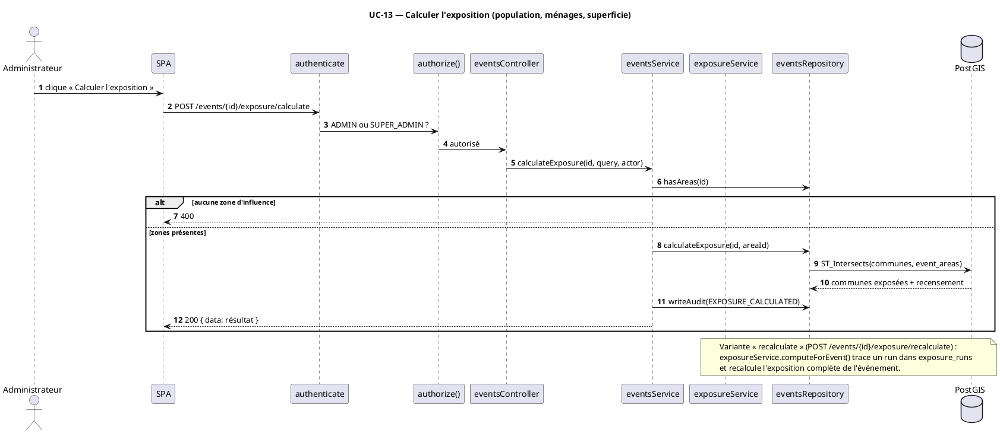
```plantuml
@startuml UC-13_exposition
title UC-13 — Calculer l'exposition (population, ménages, superficie)
autonumber
actor "Administrateur" as U
participant "SPA" as SPA
participant "authenticate" as AUTH
participant "authorize()" as AZ
participant "eventsController" as C
participant "eventsService" as SVC
participant "exposureService" as EXP
participant "eventsRepository" as REPO
database "PostGIS" as DB

U -> SPA : clique « Calculer l'exposition »
SPA -> AUTH : POST /events/{id}/exposure/calculate
AUTH -> AZ : ADMIN ou SUPER_ADMIN ?
AZ -> C : autorisé
C -> SVC : calculateExposure(id, query, actor)
SVC -> REPO : hasAreas(id)
alt aucune zone d'influence
  SVC --> SPA : 400
else zones présentes
  SVC -> REPO : calculateExposure(id, areaId)
  REPO -> DB : ST_Intersects(communes, event_areas)
  DB --> REPO : communes exposées + recensement
  SVC -> REPO : writeAudit(EXPOSURE_CALCULATED)
  SVC --> SPA : 200 { data: résultat }
end

note over EXP, DB
  Variante « recalculate » (POST /events/{id}/exposure/recalculate) :
  exposureService.computeForEvent() trace un run dans exposure_runs
  et recalcule l'exposition complète de l'événement.
end note
@enduml
```

### UC-14 — Consulter les communes exposées, impacts et alertes à un instant

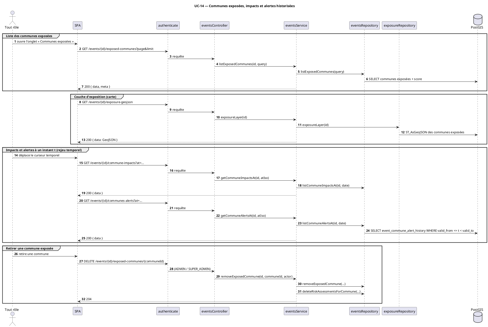
```plantuml
@startuml UC-14_communes_exposees
title UC-14 — Communes exposées, impacts et alertes historisées
autonumber
actor "Tout rôle" as U
participant "SPA" as SPA
participant "authenticate" as AUTH
participant "eventsController" as C
participant "eventsService" as SVC
participant "eventsRepository" as REPO
participant "exposureRepository" as EXP
database "PostGIS" as DB

group Liste des communes exposées
  U -> SPA : ouvre l'onglet « Communes exposées »
  SPA -> AUTH : GET /events/{id}/exposed-communes?page&limit
  AUTH -> C : requête
  C -> SVC : listExposedCommunes(id, query)
  SVC -> REPO : listExposedCommunes(query)
  REPO -> DB : SELECT communes exposées + score
  SVC --> SPA : 200 { data, meta }
end

group Couche d'exposition (carte)
  SPA -> AUTH : GET /events/{id}/exposure-geojson
  AUTH -> C : requête
  C -> SVC : exposureLayer(id)
  SVC -> EXP : exposureLayer(id)
  EXP -> DB : ST_AsGeoJSON des communes exposées
  SVC --> SPA : 200 { data: GeoJSON }
end

group Impacts et alertes à un instant t (rejeu temporel)
  U -> SPA : déplace le curseur temporel
  SPA -> AUTH : GET /events/{id}/commune-impacts?at=...
  AUTH -> C : requête
  C -> SVC : getCommuneImpactsAt(id, atIso)
  SVC -> REPO : listCommuneImpactsAt(id, date)
  SVC --> SPA : 200 { data }

  SPA -> AUTH : GET /events/{id}/communes-alerts?at=...
  AUTH -> C : requête
  C -> SVC : getCommuneAlertsAt(id, atIso)
  SVC -> REPO : listCommuneAlertsAt(id, date)
  REPO -> DB : SELECT event_commune_alert_history WHERE valid_from <= t < valid_to
  SVC --> SPA : 200 { data }
end

group Retirer une commune exposée
  U -> SPA : retire une commune
  SPA -> AUTH : DELETE /events/{id}/exposed-communes/{communeId}
  AUTH -> C : (ADMIN / SUPER_ADMIN)
  C -> SVC : removeExposedCommune(id, communeId, actor)
  SVC -> REPO : removeExposedCommune(...)
  SVC -> REPO : deleteRiskAssessmentsForCommune(...)
  SVC --> SPA : 204
end
@enduml
```

---

## E. Météo

### UC-15 — Consulter la météo (cartes, prévisions, historique)

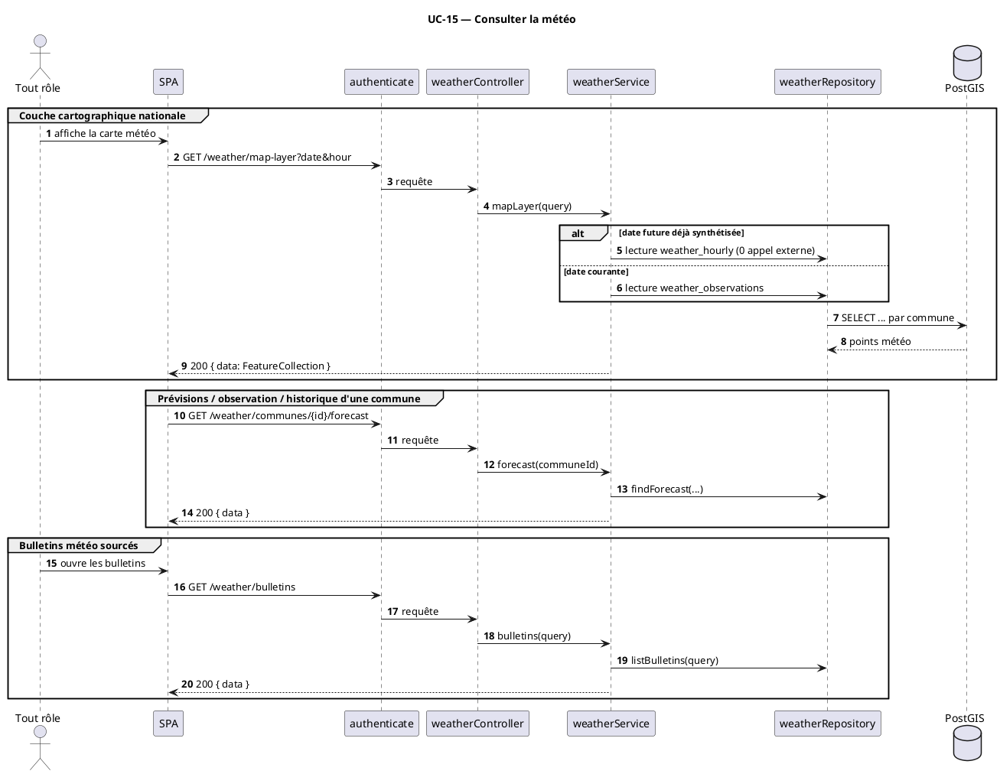
```plantuml
@startuml UC-15_meteo_consultation
title UC-15 — Consulter la météo
autonumber
actor "Tout rôle" as U
participant "SPA" as SPA
participant "authenticate" as AUTH
participant "weatherController" as C
participant "weatherService" as SVC
participant "weatherRepository" as REPO
database "PostGIS" as DB

group Couche cartographique nationale
  U -> SPA : affiche la carte météo
  SPA -> AUTH : GET /weather/map-layer?date&hour
  AUTH -> C : requête
  C -> SVC : mapLayer(query)
  alt date future déjà synthétisée
    SVC -> REPO : lecture weather_hourly (0 appel externe)
  else date courante
    SVC -> REPO : lecture weather_observations
  end
  REPO -> DB : SELECT ... par commune
  DB --> REPO : points météo
  SVC --> SPA : 200 { data: FeatureCollection }
end

group Prévisions / observation / historique d'une commune
  SPA -> AUTH : GET /weather/communes/{id}/forecast
  AUTH -> C : requête
  C -> SVC : forecast(communeId)
  SVC -> REPO : findForecast(...)
  SVC --> SPA : 200 { data }
end

group Bulletins météo sourcés
  U -> SPA : ouvre les bulletins
  SPA -> AUTH : GET /weather/bulletins
  AUTH -> C : requête
  C -> SVC : bulletins(query)
  SVC -> REPO : listBulletins(query)
  SVC --> SPA : 200 { data }
end
@enduml
```

### UC-16 — Synchroniser la météo et ingérer la DGM

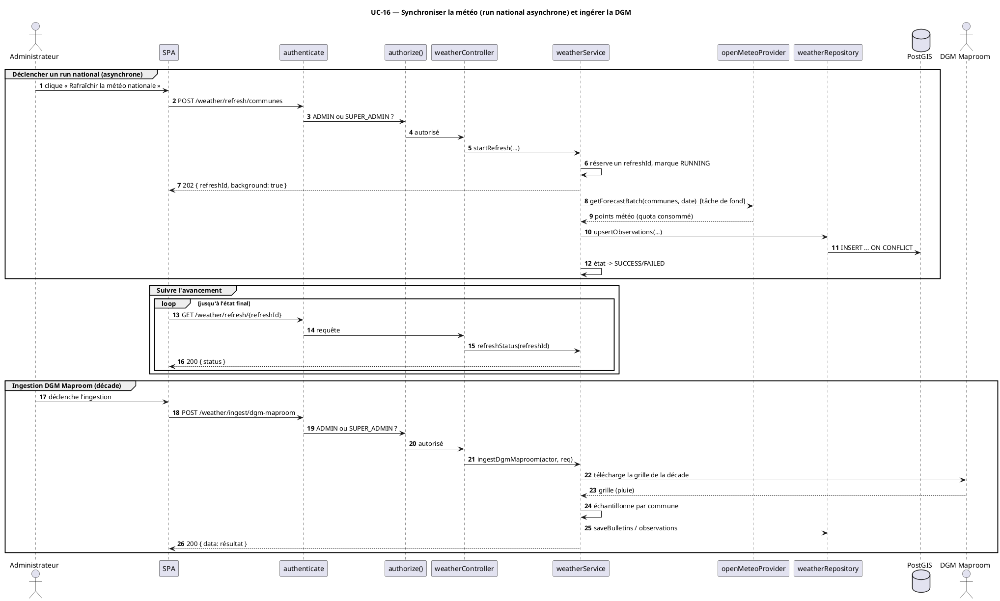
```plantuml
@startuml UC-16_meteo_sync
title UC-16 — Synchroniser la météo (run national asynchrone) et ingérer la DGM
autonumber
actor "Administrateur" as U
participant "SPA" as SPA
participant "authenticate" as AUTH
participant "authorize()" as AZ
participant "weatherController" as C
participant "weatherService" as SVC
participant "openMeteoProvider" as PROV
participant "weatherRepository" as REPO
database "PostGIS" as DB
actor "DGM Maproom" as DGM

group Déclencher un run national (asynchrone)
  U -> SPA : clique « Rafraîchir la météo nationale »
  SPA -> AUTH : POST /weather/refresh/communes
  AUTH -> AZ : ADMIN ou SUPER_ADMIN ?
  AZ -> C : autorisé
  C -> SVC : startRefresh(...)
  SVC -> SVC : réserve un refreshId, marque RUNNING
  SVC --> SPA : 202 { refreshId, background: true }
  SVC -> PROV : getForecastBatch(communes, date)  [tâche de fond]
  PROV --> SVC : points météo (quota consommé)
  SVC -> REPO : upsertObservations(...)
  REPO -> DB : INSERT ... ON CONFLICT
  SVC -> SVC : état -> SUCCESS/FAILED
end

group Suivre l'avancement
  loop jusqu'à l'état final
    SPA -> AUTH : GET /weather/refresh/{refreshId}
    AUTH -> C : requête
    C -> SVC : refreshStatus(refreshId)
    SVC --> SPA : 200 { status }
  end
end

group Ingestion DGM Maproom (décade)
  U -> SPA : déclenche l'ingestion
  SPA -> AUTH : POST /weather/ingest/dgm-maproom
  AUTH -> AZ : ADMIN ou SUPER_ADMIN ?
  AZ -> C : autorisé
  C -> SVC : ingestDgmMaproom(actor, req)
  SVC -> DGM : télécharge la grille de la décade
  DGM --> SVC : grille (pluie)
  SVC -> SVC : échantillonne par commune
  SVC -> REPO : saveBulletins / observations
  SVC --> SPA : 200 { data: résultat }
end
@enduml
```

---

## F. Risques

### UC-17 — Recalculer les risques et consulter la carte des risques

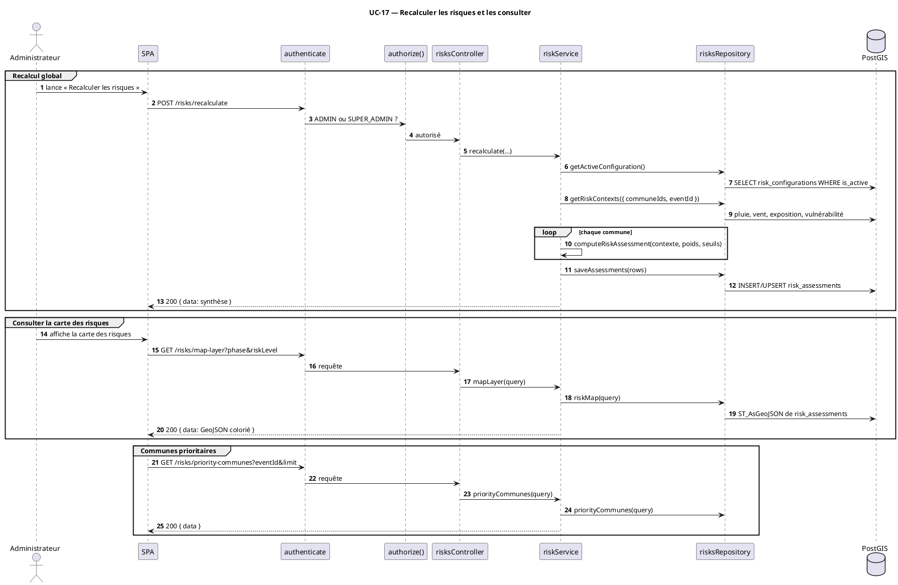
```plantuml
@startuml UC-17_risques
title UC-17 — Recalculer les risques et les consulter
autonumber
actor "Administrateur" as U
participant "SPA" as SPA
participant "authenticate" as AUTH
participant "authorize()" as AZ
participant "risksController" as C
participant "riskService" as SVC
participant "risksRepository" as REPO
database "PostGIS" as DB

group Recalcul global
  U -> SPA : lance « Recalculer les risques »
  SPA -> AUTH : POST /risks/recalculate
  AUTH -> AZ : ADMIN ou SUPER_ADMIN ?
  AZ -> C : autorisé
  C -> SVC : recalculate(...)
  SVC -> REPO : getActiveConfiguration()
  REPO -> DB : SELECT risk_configurations WHERE is_active
  SVC -> REPO : getRiskContexts({ communeIds, eventId })
  REPO -> DB : pluie, vent, exposition, vulnérabilité
  loop chaque commune
    SVC -> SVC : computeRiskAssessment(contexte, poids, seuils)
  end
  SVC -> REPO : saveAssessments(rows)
  REPO -> DB : INSERT/UPSERT risk_assessments
  SVC --> SPA : 200 { data: synthèse }
end

group Consulter la carte des risques
  U -> SPA : affiche la carte des risques
  SPA -> AUTH : GET /risks/map-layer?phase&riskLevel
  AUTH -> C : requête
  C -> SVC : mapLayer(query)
  SVC -> REPO : riskMap(query)
  REPO -> DB : ST_AsGeoJSON de risk_assessments
  SVC --> SPA : 200 { data: GeoJSON colorié }
end

group Communes prioritaires
  SPA -> AUTH : GET /risks/priority-communes?eventId&limit
  AUTH -> C : requête
  C -> SVC : priorityCommunes(query)
  SVC -> REPO : priorityCommunes(query)
  SVC --> SPA : 200 { data }
end
@enduml
```

### UC-18 — Gérer les configurations de risque

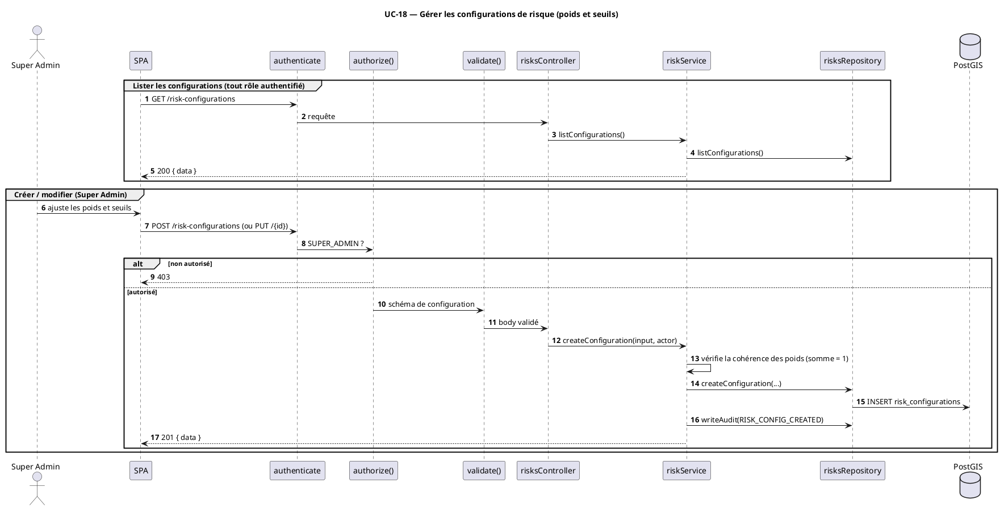
```plantuml
@startuml UC-18_config_risque
title UC-18 — Gérer les configurations de risque (poids et seuils)
autonumber
actor "Super Admin" as U
participant "SPA" as SPA
participant "authenticate" as AUTH
participant "authorize()" as AZ
participant "validate()" as V
participant "risksController" as C
participant "riskService" as SVC
participant "risksRepository" as REPO
database "PostGIS" as DB

group Lister les configurations (tout rôle authentifié)
  SPA -> AUTH : GET /risk-configurations
  AUTH -> C : requête
  C -> SVC : listConfigurations()
  SVC -> REPO : listConfigurations()
  SVC --> SPA : 200 { data }
end

group Créer / modifier (Super Admin)
  U -> SPA : ajuste les poids et seuils
  SPA -> AUTH : POST /risk-configurations (ou PUT /{id})
  AUTH -> AZ : SUPER_ADMIN ?
  alt non autorisé
    AZ --> SPA : 403
  else autorisé
    AZ -> V : schéma de configuration
    V -> C : body validé
    C -> SVC : createConfiguration(input, actor)
    SVC -> SVC : vérifie la cohérence des poids (somme = 1)
    SVC -> REPO : createConfiguration(...)
    REPO -> DB : INSERT risk_configurations
    SVC -> REPO : writeAudit(RISK_CONFIG_CREATED)
    SVC --> SPA : 201 { data }
  end
end
@enduml
```

---

## G. Détection automatique et alertes

### UC-19 — Gérer les règles de détection (Super Admin)

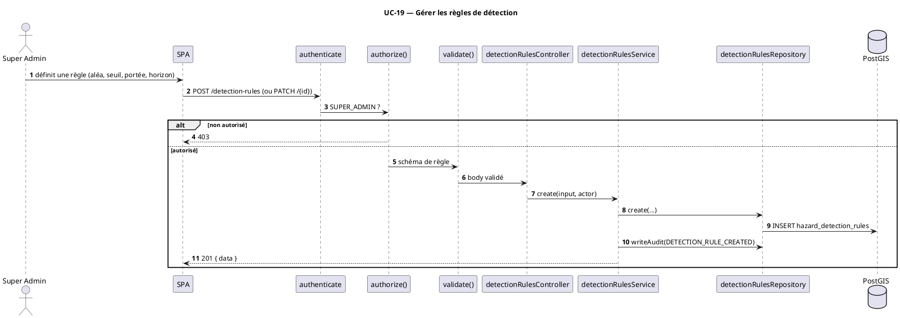
```plantuml
@startuml UC-19_regles_detection
title UC-19 — Gérer les règles de détection
autonumber
actor "Super Admin" as U
participant "SPA" as SPA
participant "authenticate" as AUTH
participant "authorize()" as AZ
participant "validate()" as V
participant "detectionRulesController" as C
participant "detectionRulesService" as SVC
participant "detectionRulesRepository" as REPO
database "PostGIS" as DB

U -> SPA : définit une règle (aléa, seuil, portée, horizon)
SPA -> AUTH : POST /detection-rules (ou PATCH /{id})
AUTH -> AZ : SUPER_ADMIN ?
alt non autorisé
  AZ --> SPA : 403
else autorisé
  AZ -> V : schéma de règle
  V -> C : body validé
  C -> SVC : create(input, actor)
  SVC -> REPO : create(...)
  REPO -> DB : INSERT hazard_detection_rules
  SVC -> REPO : writeAudit(DETECTION_RULE_CREATED)
  SVC --> SPA : 201 { data }
end
@enduml
```

### UC-20 — Lancer la détection de dangers

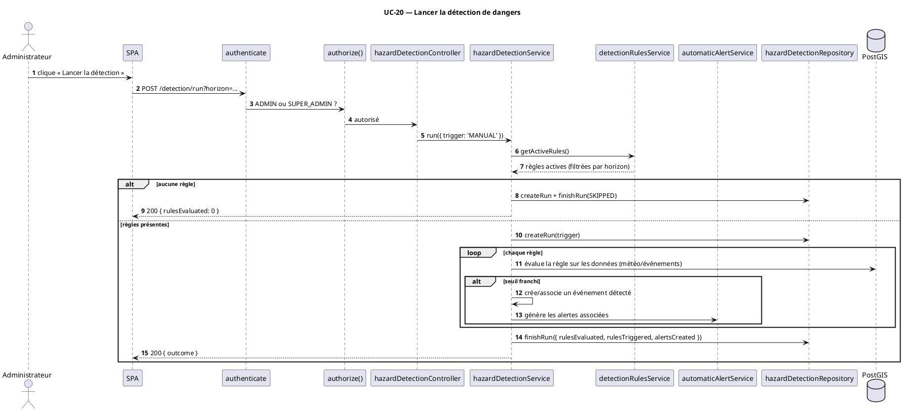
```plantuml
@startuml UC-20_detection
title UC-20 — Lancer la détection de dangers
autonumber
actor "Administrateur" as U
participant "SPA" as SPA
participant "authenticate" as AUTH
participant "authorize()" as AZ
participant "hazardDetectionController" as C
participant "hazardDetectionService" as SVC
participant "detectionRulesService" as RULES
participant "automaticAlertService" as ALERTS
participant "hazardDetectionRepository" as REPO
database "PostGIS" as DB

U -> SPA : clique « Lancer la détection »
SPA -> AUTH : POST /detection/run?horizon=...
AUTH -> AZ : ADMIN ou SUPER_ADMIN ?
AZ -> C : autorisé
C -> SVC : run({ trigger: 'MANUAL' })
SVC -> RULES : getActiveRules()
RULES --> SVC : règles actives (filtrées par horizon)
alt aucune règle
  SVC -> REPO : createRun + finishRun(SKIPPED)
  SVC --> SPA : 200 { rulesEvaluated: 0 }
else règles présentes
  SVC -> REPO : createRun(trigger)
  loop chaque règle
    SVC -> DB : évalue la règle sur les données (météo/événements)
    alt seuil franchi
      SVC -> SVC : crée/associe un événement détecté
      SVC -> ALERTS : génère les alertes associées
    end
  end
  SVC -> REPO : finishRun({ rulesEvaluated, rulesTriggered, alertsCreated })
  SVC --> SPA : 200 { outcome }
end
@enduml
```

### UC-21 — Générer et gérer les alertes

```plantuml
@startuml UC-21_alertes
title UC-21 — Générer puis gérer les alertes
autonumber
actor "Administrateur" as U
participant "SPA" as SPA
participant "authenticate" as AUTH
participant "authorize()" as AZ
participant "alertsController" as C
participant "alertsService" as SVC
participant "alertsRepository" as REPO
participant "SSE" as SSE
database "PostGIS" as DB

group Génération automatique
  U -> SPA : lance la génération
  SPA -> AUTH : POST /alerts/automatic/generate
  AUTH -> AZ : ADMIN ou SUPER_ADMIN ?
  AZ -> C : autorisé
  C -> SVC : generateAutomatic(input, actor)
  SVC -> REPO : sélectionne les événements/communes concernés
  loop communes concernées
    SVC -> REPO : create({ ... statut BROUILLON })
  end
  REPO -> DB : INSERT alerts
  SVC -> REPO : writeAudit(ALERTS_GENERATED)
  SVC --> SPA : 200 { data }
end

group Créer manuellement
  U -> SPA : rédige une alerte
  SPA -> AUTH : POST /alerts
  AUTH -> AZ : ADMIN ou SUPER_ADMIN ?
  AZ -> C : autorisé
  C -> SVC : create(input, actor)
  SVC -> REPO : create(...)
  REPO -> DB : INSERT alerts
  SVC -> SSE : publish('alert.created', { alertId, status })
  SVC --> SPA : 201 { data }
end

group Publier / archiver
  U -> SPA : publie une alerte
  SPA -> AUTH : POST /alerts/{id}/publish
  AUTH -> AZ : ADMIN ou SUPER_ADMIN ?
  AZ -> C : autorisé
  C -> SVC : publish(id, actor)
  SVC -> REPO : findById(id)
  SVC -> REPO : publish(id)  [statut PUBLIEE]
  REPO -> DB : UPDATE alerts + historique
  SVC -> REPO : writeAudit(ALERT_PUBLISHED)
  SVC -> SSE : publish('alert.updated', { alertId, status })
  SVC --> SPA : 200 { data }
end

group Consulter et historique
  SPA -> AUTH : GET /alerts?status&eventId
  AUTH -> C : requête
  C -> SVC : list(query, actor)
  SVC -> REPO : list(query)
  SVC --> SPA : 200 { data, meta }

  SPA -> AUTH : GET /alerts/{id}/history
  AUTH -> C : requête
  C -> SVC : getHistory(id)
  SVC -> REPO : listHistory(id)
  SVC --> SPA : 200 { data }
end
@enduml
```

---

## H. Tableau de bord et rapports

### UC-22 — Consulter le tableau de bord

```plantuml
@startuml UC-22_dashboard
title UC-22 — Consulter le tableau de bord
autonumber
actor "Tout rôle" as U
participant "SPA" as SPA
participant "authenticate" as AUTH
participant "dashboardController" as C
participant "dashboardService" as SVC
participant "dashboardRepository" as REPO
database "PostGIS" as DB

U -> SPA : ouvre le tableau de bord
par Requêtes parallèles (TanStack Query)
  SPA -> AUTH : GET /dashboard/summary
  AUTH -> C : requête
  C -> SVC : summary()
  SVC -> REPO : summaryData()
  SVC --> SPA : 200 { compteurs }
else
  SPA -> AUTH : GET /dashboard/risk-distribution
  AUTH -> C : requête
  C -> SVC : riskDistribution()
  SVC --> SPA : 200 { data }
else
  SPA -> AUTH : GET /dashboard/events-timeline
  AUTH -> C : requête
  C -> SVC : eventsTimeline()
  SVC --> SPA : 200 { data }
else
  SPA -> AUTH : GET /dashboard/priority-communes
  AUTH -> C : requête
  C -> SVC : priorityCommunes()
  SVC --> SPA : 200 { data }
end
@enduml
```

### UC-23 — Générer un rapport et exporter des données

```plantuml
@startuml UC-23_rapports
title UC-23 — Générer un rapport / exporter (CSV, GeoJSON, PDF)
autonumber
actor "Administrateur" as U
participant "SPA" as SPA
participant "authenticate" as AUTH
participant "authorize()" as AZ
participant "validate()" as V
participant "reportsController" as C
participant "reportsService" as SVC
participant "reportsRepository" as REPO
participant "pdfkit / json2csv" as LIB
database "PostGIS" as DB

group Export PDF
  U -> SPA : choisit « Rapport PDF »
  SPA -> AUTH : POST /reports/export/pdf
  AUTH -> AZ : ADMIN ou SUPER_ADMIN ?
  AZ -> V : pdfExportSchema
  V -> C : body validé
  C -> SVC : exportPdf(context, actor)
  SVC -> REPO : collecte les données (événement, communes, risques)
  REPO -> DB : SELECT ...
  SVC -> LIB : construit le PDF
  LIB --> SVC : Buffer
  SVC -> SVC : writeReportFile('.pdf')
  SVC -> REPO : save({ type, format, filePath, parameters })
  REPO -> DB : INSERT reports
  SVC -> REPO : writeAudit(REPORT_GENERATED)
  SVC --> SPA : 201 { data: report }
end

group Export CSV / GeoJSON
  SPA -> AUTH : POST /reports/export/csv (ou /geojson)
  AUTH -> AZ : rôle autorisé
  AZ -> C : autorisé
  C -> SVC : exportCsv(context, actor)
  SVC -> REPO : csvCommunes/csvDistricts/...
  SVC -> SVC : sérialise + persiste le fichier
  SVC --> SPA : 201 { data: report }
end

group Télécharger un rapport
  U -> SPA : clique « Télécharger »
  SPA -> AUTH : GET /reports/{id}/download
  AUTH -> C : requête
  C -> SVC : download(id, actor)
  SVC -> REPO : findById(id)
  SVC --> SPA : 200 (flux du fichier)
end
@enduml
```

---

## I. Assistant IA

### UC-24 — Dialoguer avec l'assistant IA

> Correspond au cas d'utilisation **UC35 « Dialoguer avec l'assistant IA »** du
> catalogue (`diagramme-cas-utilisation.md`) ; l'assistant est l'unique
> consommateur du service externe Gemini. Le tour est produit par **un seul
> chemin** — `chat()` se contente d'accumuler `chatStream()` — donc la version
> d'un bloc et la version en flux ne peuvent pas diverger.

```plantuml
@startuml UC-24_ia
title UC-24 — Dialoguer avec l'assistant IA (POST /ai/chat)
autonumber
actor "Tout rôle" as U
participant "SPA" as SPA
participant "aiChatLimiter" as RL
participant "authenticate + validate" as AUTH
participant "aiController" as C
participant "aiService" as SVC
participant "aiRepository" as REPO
participant "Outils internes" as TOOLS
actor "Gemini" as LLM
database "PostGIS" as DB

U -> SPA : pose une question en langage naturel
SPA -> RL : POST /ai/chat { message, conversationId?, stream? }
RL -> AUTH : sous la limite (30 questions / 15 min / utilisateur)
note right of RL
  Au-delà : 429 + Retry-After,
  avant toute préparation.
end note
AUTH -> C : req.user + corps validé (zod)

group Préparation du tour — prepareTurn()
  C -> SVC : chat(user, input)  ou  chatStream(user, input)
  SVC -> SVC : getAIProvider().isAvailable()
  alt Assistant IA non configuré
    SVC --> C : 503 « Service IA non configuré »
  else Configuré
    SVC -> SVC : resolveOrCreateConversation(user, conversationId)
    SVC -> REPO : addMessage(role = UTILISATEUR)
    SVC -> SVC : selectTools(message) — socle déterministe (mots-clés)
    SVC -> SVC : detectInjection(message)
    loop chaque outil du socle
      SVC -> TOOLS : runTool(nom, contexte)
      TOOLS -> DB : territoires / événements / risques / alertes / météo
      DB --> TOOLS : données
      TOOLS --> SVC : résultat
    end
    SVC -> REPO : persistToolResults(role = OUTIL)
  end
end

note over C
  En flux, le PREMIER événement est produit AVANT flushHeaders() :
  une erreur de préparation (503, 404, 429) reste un vrai statut
  HTTP, et non un 200 suivi d'un événement `error`.
end note

SVC -> LLM : generateAnswerStreamWithTools(question, contexte, TOOL_DECLARATIONS)

alt Quota Gemini épuisé
  LLM --> SVC : 429 « Please retry in … »
  SVC --> C : AppError 429 + retryAfterSeconds (délai LU, jamais deviné)
  C --> SPA : 429 + Retry-After — aucune relance
else Le modèle réclame un ou des outils (function calling)
  LLM --> SVC : functionCalls [ { nom, arguments } ]
  note right of SVC
    Un seul aller-retour, borné :
    - arguments revalidés par le schéma zod de l'outil ;
    - identifiants (UUID) résolus côté serveur, jamais inventés ;
    - outil inconnu, ou déjà couvert par le socle : ignoré ;
    - plafond 6 outils, un même outil une fois par tour ;
    - demande d'outil reçue APRÈS du texte : ignorée.
  end note
  SVC -> TOOLS : runModelToolCalls(appels)
  TOOLS -> DB : lit la donnée manquante
  DB --> TOOLS : données
  TOOLS --> SVC : résultat
  SVC -> REPO : persistToolResults(role = OUTIL)
  SVC -> LLM : generateAnswerStream(contexte enrichi) — SANS déclarations
  LLM --> SVC : morceaux de texte
else Le modèle répond directement
  LLM --> SVC : morceaux de texte
end

SVC -> SVC : computeDataTimestamp(toolResults) — données figées
SVC --> C : événement meta { conversationId, internalSources, dataTimestamp, limitations }
SVC --> C : événement chunk { text } (× n)
SVC -> REPO : addMessage(role = ASSISTANT, réponse COMPLÈTE)
SVC -> REPO : touchConversation()
SVC --> C : événement done { conversationId }
C --> SPA : 200 text/event-stream

alt Panne survenue après le début du flux
  SVC --> C : exception
  C --> SPA : événement error { message, status }
  note right of SPA
    Le statut est déjà figé à 200 :
    l'échec passe par le flux.
  end note
end

note over SVC, REPO
  Aucun texte n'a été produit (flux vide) : 502 plutôt qu'une
  réponse vide présentée comme valide.
  Client parti en cours de flux : rien n'est persisté
  (pas de message tronqué en base).
end note
@enduml
```

### UC-25 — Consulter et supprimer ses conversations IA

> Correspond au cas d'utilisation **UC36 « Gérer ses conversations »** du
> catalogue (`diagramme-cas-utilisation.md`).

```plantuml
@startuml UC-25_ia_conversations
title UC-25 — Consulter / supprimer ses conversations IA
autonumber
actor "Tout rôle" as U
participant "SPA" as SPA
participant "authenticate" as AUTH
participant "aiController" as C
participant "aiRepository" as REPO
database "PostGIS" as DB

group Lister
  U -> SPA : ouvre l'historique IA
  SPA -> AUTH : GET /ai/conversations
  AUTH -> C : req.user
  C -> REPO : listConversations(user.id)
  REPO -> DB : SELECT ai_conversations
  C --> SPA : 200 { data }
end

group Lire une conversation
  SPA -> AUTH : GET /ai/conversations/{id}
  AUTH -> C : req.user
  C -> REPO : findConversation(id, user.id)
  C --> SPA : 200 { data: messages }
end

group Supprimer
  U -> SPA : supprime une conversation
  SPA -> AUTH : DELETE /ai/conversations/{id}
  AUTH -> C : req.user
  C -> REPO : deleteConversation(id, user.id)
  REPO -> DB : DELETE ai_conversations + messages
  C --> SPA : 204
end
@enduml
```

---

## J. Temps réel et automatisation

### UC-26 — Salle de crise en temps réel (SSE)

```plantuml
@startuml UC-26_sse
title UC-26 — Salle de crise : flux temps réel (GET /stream)
autonumber
actor "Tout rôle" as U
participant "SPA" as SPA
participant "authenticate" as AUTH
participant "realtimeService" as RT
participant "API (producteurs)" as API

U -> SPA : ouvre la salle de crise
SPA -> AUTH : GET /stream (fetch + reader, Bearer)
AUTH -> AUTH : vérifie le JWT
alt token invalide
  AUTH --> SPA : 401
else token valide
  AUTH -> RT : subscribe(res)
  RT --> SPA : 200 text/event-stream + `retry: 5000`
  RT -> RT : heartbeat périodique
  note over SPA, RT
    Les producteurs publient : alert.created, alert.updated,
    hazard.detected, cyclone.sync ...
  end note
  loop à chaque publication interne
    API -> RT : publish(type, payload)
    alt au moins un abonné
      RT --> SPA : event: type / data: payload JSON
      SPA -> SPA : invalide les clés TanStack Query
    end
  end
  U -> SPA : quitte la salle de crise
  SPA -> AUTH : fermeture de la connexion
  AUTH -> RT : unsubscribe(res)
end
@enduml
```

### UC-27 — Veille cyclone automatique

```plantuml
@startuml UC-27_cyclone
title UC-27 — Veille cyclone automatique (job planifié)
autonumber
actor "Planificateur\n(node-cron)" as CRON
participant "cycloneSyncService" as SVC
participant "IBTrACS (NCEI)" as IB
participant "GDACS" as GD
participant "cycloneRepository" as REPO
participant "coloringService" as COL
participant "automaticAlertService" as ALERTS
participant "realtimeService" as RT
database "PostGIS" as DB

CRON -> SVC : run()  (CYCLONE_SYNC_CRON, ex. toutes les 3 h)
SVC -> REPO : startRun()
SVC -> IB : listActiveSystems()  (IBTrACS ACTIVE)
alt IBTrACS indisponible
  IB --> SVC : erreur
  SVC -> SVC : marque la source non répondue
else réponse IBTrACS
  IB --> SVC : trajectoires + rayons R34/R50/R64
end
SVC -> GD : liste des systèmes actifs (GDACS)
alt GDACS indisponible
  GD --> SVC : erreur
else réponse GDACS
  GD --> SVC : événements + episodes
end
SVC -> SVC : apparie IBTrACS <-> GDACS (event_code stable)
SVC -> SVC : réduit les rayons (max des 4 quadrants, 1 nmi = 1,852 km)
SVC -> REPO : persistPlan(systèmes, points, rayons)
REPO -> DB : UPSERT cyclone_systems, tracks, radii
SVC -> COL : applyToEvent(systèmes actifs)
COL -> DB : recolore les communes (ROUGE/JAUNE/VERT/BLEU)
COL -> ALERTS : generateForEvent(...)
ALERTS -> DB : INSERT event_commune_alert_history
SVC -> REPO : closeStaleWatchedEvents() + failInterruptedRuns()
REPO -> DB : UPDATE ... (clôture des sorties de veille)
SVC -> REPO : finishRun(summary)
alt nouveaux événements ou clôtures
  SVC -> RT : publish('cyclone.sync', summary)
  RT --> SVC : diffusion aux abonnés SSE
end
@enduml
```

---

## K. Supervision

### UC-28 — Superviser la santé du système

```plantuml
@startuml UC-28_supervision
title UC-28 — Superviser la santé du système
autonumber
actor "Exploitant" as U
participant "Monitoring" as MON
participant "API" as API
participant "healthController" as C
participant "PostGIS" as DB

group Sonde applicative
  MON -> API : GET /health
  API -> C : requête
  C --> MON : 200 { status: 'ok', uptime }
end

group État de la base
  MON -> API : GET /system/database-status
  API -> C : requête
  C -> DB : SELECT version(), PostGIS, comptages
  DB --> C : état
  C --> MON : 200 { database, districts, communes }
end
@enduml
```
